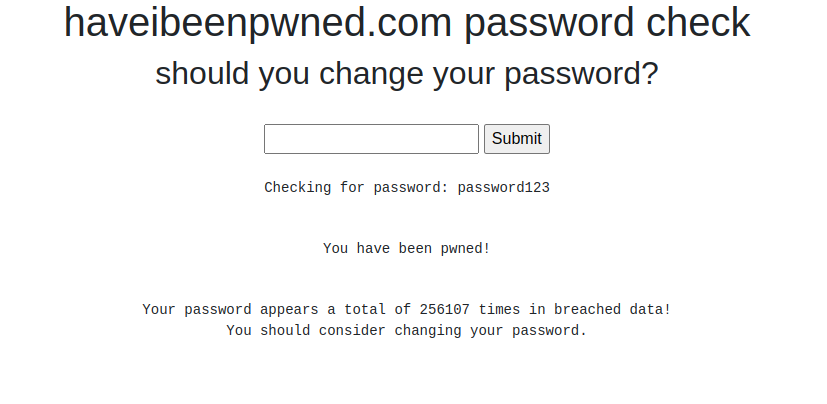

# haveibeenpwned

Pwned Passwords are hundreds of millions of passwords which have previously been exposed in data breaches. The data is queryable online via the Pwned Passwords webpage, accessible via the API or downloadable as an entire corpus of data that can be queried offline. The Pwned Passwords API is freely accessible without the need for a subscription and API key.

This is a Django 5 project which uses the Pwned Passwords API for password queries. 

     

